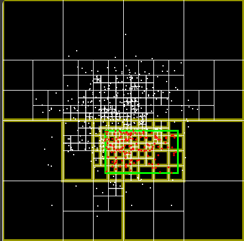

# My Quadtree Point Search Solution

## Overview

In this solution, I leveraged a quadtree data structure to efficiently search for points within a specified rectangular query region. The quadtree allows us to organize points spatially and optimize point retrieval. [Click here for the interactive demo:](https://pescadorbob.github.io/quad-trees/) See **Figure 1**

**Figure 1**

Here's how I tackled it:

## 1. Quadtree Construction

### Dividing the Space

- I started by defining the entire 2D space (bounding box).
- Then, I recursively divided it into four equal quadrants: NW (northwest), NE (northeast), SW (southwest), and SE (southeast).

### Inserting Points

- For each point, I determined which quadrant it belonged to based on its coordinates.
- If a quadrant contained more points than a predefined threshold (let's call it `MAX_POINTS_PER_QUADRANT`), I further subdivided it.

### Recursion

- I repeated the subdivision process recursively for each quadrant until either:
  - The desired depth was reached (controlled by a maximum depth parameter).
  - The quadrant contained fewer points than the threshold.

## 2. Point Search

### Query Region

- When a user queried for points within a rectangular region (defined by its top-left and bottom-right corners), I initiated the search.

### Traversal

- I traversed the quadtree, checking each quadrant:
  - If it intersected the query region, I explored it further.
  - If it was fully contained within the query region, I considered all points within that quadrant as relevant.
  - If it didn't intersect, I pruned it entirely (no need to search deeper).

### Combining Results

- Finally, I collected all relevant points from intersecting quadrants and returned them as the search result.

## 3. Interactive Query Range

### Mouse Interaction

- To enhance user experience, I allowed users to adjust the query range using mouse clicks.
- As the user clicked and dragged the mouse, the query region dynamically updated.

### Visual Feedback

- I highlighted intersecting quadrants during the search.
- By visually showing the bounding boxes of relevant quadrants, users could understand the impact of their query range adjustments.

## 4. Visualization

### Quadtree Nodes

- I drew the bounding boxes for each quadrant in the quadtree.
- Labeling them (NW, NE, SW, SE) made the visualization clearer.
- As points were inserted and the tree structure changed, I updated the visualization accordingly.

### Search Highlight

- During point searches, I used different colors or patterns to highlight intersecting quadrants.
- The points found within those quadrants were displayed.

## Conclusion

My solution combines efficient point search, interactive query range adjustment, and informative visualization. It's a powerful tool for spatial data analysis and can be adapted for various applications.

## References

Feel free to explore the specific implementation details, code snippets, or any other aspects of the project [here](https://github.com/pescadorbob/quad-trees). If you have further questions or desire additional conversation, feel free to ask! 🌳🔍