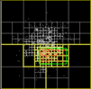
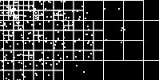
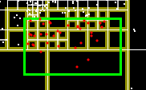

# My Quadtree Point Search Solution

## Overview

In this solution, I leveraged a quadtree data structure to efficiently search for points within a specified rectangular query region. The quadtree allows us to organize points spatially and optimize point retrieval. [Click here for the interactive demo:](https://pescadorbob.github.io/quad-trees/) See **Figure 1**




**Figure 1**


Here's how I tackled it:

## 1. Quadtree Construction

### Dividing the Space

- I started by defining the entire 2D space (bounding box) with a `Rectangle`.

    ```javascript
    class Rectangle {
    constructor(x, y, w, h) {
        this.x = x; // the middle of the rectangle
        this.y = y; // the middle of the rectangle
        this.w = w; // the width from middle to side
        this.h = h; // the height, from middle to top or bottom. 
        this.left = x - w;
        this.right = x + w;
        this.top = y - h;
        this.bottom = y + h;
    }
    ...
    }
    ```
- Then, I recursively divided it into four equal quadrants: NW (northwest), NE (northeast), SW (southwest), and SE (southeast).

    ```JavaScript
    class QuadTree {
    constructor(boundary, n = DEFAULT_CAPACITY) {
        this.boundary = boundary;
        this.capacity = n;
        this.points = [];
        this.nw = null;
        this.ne = null;
        this.se = null;
        this.sw = null;
        this.isDivided = false;
    }
    ...
    }
    ```

### Inserting Points

- For each point, I determined which quadrant it belonged to based on its coordinates.
- If a quadrant contained more points than a predefined threshold (let's call it `DEFAULT_CAPACITY`), I further subdivided it.

```JavaScript
        function insert(point) {            
            if (!this.within(point)) return;
            if (this.points && this.points.length < this.capacity) {
            this.points.push(point);            
            }
        }
```


### Recursion

- I repeated the subdivision process recursively for each quadrant until either:
  - The desired depth was reached (controlled by a maximum depth parameter).
  - The quadrant contained fewer points than the threshold.


    ```javascript
        if (!this.isDivided) {
            this.subdivide();
            this.isDivided = true;
        }
        if (this.nw.within(point)) this.nw.insert(point);
        else if (this.ne.within(point)) this.ne.insert(point);
        else if (this.se.within(point)) this.se.insert(point);
        else if (this.sw.within(point)) this.sw.insert(point);
        else console.log("Error: p is not within any boundary");
    ```
## 2. Point Search

### Query Region

- When a user queried for points within a rectangular region, I initiated the search. Note that in this implementation, a Rectangle is defined by its middle point, x:y and the width and height. Width and height are both only the distance from the middle point to the outer edge, so its really 2X width for the total width of the rectangle. I started by finding all of the bounding quad trees for the query rectangle

```JavaScript
    class QuadTree {

        queryTrees(range, found) {

            if (this.boundary.intersects(range)) {
            found.push(this);
            } else return;

            if (!this.isDivided) {
            } else {
            let sections = [this.nw, this.ne, this.se, this.sw];
            sections.forEach(quad => {
                quad.queryTrees(range, found);
            });
            }
        }
        intersects(range) {
            return !(this.right < range.left ||
            this.left > range.right ||
            this.top > range.bottom ||
            this.bottom  < range.top
            )

        }
    }
```


### Traversal

- I traversed the quadtree, checking each quadrant:
  - If it intersected the query region, I explored it further.
  - If it was fully contained within the query region, I considered all points within that quadrant as relevant.
  - If it didn't intersect, I pruned it entirely (no need to search deeper).

```javascript
        if (this.boundary.intersects(range)) {
        found.push(this);
        } else return;
```

### Combining Results

- Finally, I collected all relevant points from intersecting quadrants and returned them as the search result.

  Then, I search the points in those quad trees.
```JavaScript
        function highlightSearchPoints(range){
            let trees = [];
            qt.queryTrees(range,trees);
            for(let tree of trees){
                if(!tree.isDivided){
                    for(let p of tree.points){
                        if(range.contains(p)){
                            stroke(255,0,0);
                            strokeWeight(3);

                            point(p.x,p.y);
                        }
                    }
                }
            }
        }

```

## 3. Interactive Query Range

### Mouse Interaction

- To enhance user experience, I allowed users to adjust the query range using mouse clicks.
- As the user clicked and dragged the mouse, the query region dynamically updated.

```JavaScript
        function draw(){
            background(0);
            if(mouseIsPressed){
                searchRange = new Rectangle(mouseX,mouseY,searchRange.w,searchRange.h);
            }
            highlightIntersections(searchRange);
            show(qt);
            drawSearchRange(searchRange);
            highlightSearchPoints(searchRange);
        }

```

### Visual Feedback

- I highlighted intersecting quadrants during the search.
- By visually showing the bounding boxes of relevant quadrants, users could understand the impact of their query range adjustments.

```JavaScript
        function highlightIntersections(range){
            let rectangles = [];
            qt.queryTrees(range,rectangles);
            for(let tree of rectangles){
                let r = tree.boundary;
                strokeWeight(6);
                stroke(150,150,0);
                rectMode(CENTER);
                noFill();
                rect(r.x,r.y,2*r.w,2*r.h);
            }

        }
```

## 4. Visualization

### Quadtree Nodes

- I drew the bounding boxes for each quadrant in the quadtree.

  

### Search Highlight

- During point searches, I used different colors to highlight intersecting quadrants.
- The points found within those quadrants were displayed a different color.

   

## Conclusion

My solution combines efficient point search, interactive query range adjustment, and informative visualization. It's a powerful tool for spatial data analysis and can be adapted for various applications.


Feel free to explore the specific implementation details, code snippets, or any other aspects of the project [here](https://github.com/pescadorbob/quad-trees). If you have further questions or desire additional conversation, feel free to ask! 🌳🔍

## References

- This GitHub Repo: https://github.com/pescadorbob/quad-trees
- P5js: https://p5js.org/
- TheCodingTrain: https://thecodingtrain.com/challenges/98-quadtree
